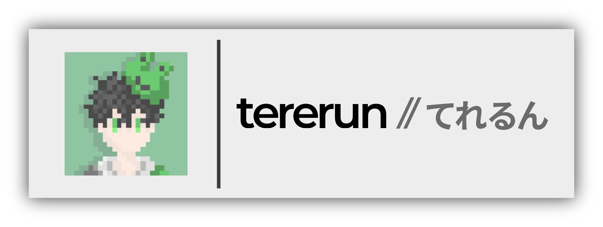

 

# Hey guys!

「作りたいものを、好きなだけ。」

何時もコードを書き続けている高校生よわよわプログラマーてれるんと申します。
以後お見知りおきを。

## Works
 - Organisation
   - [FREESERVER Project](https://freeserver.pro)
   - [いぬたぬきクリエイティブアカデミア](https://inu-dev.tech/)
   - [プラ塾](https://purajuku.dev/)
 - Plugins
   - [HyperCrate](https://www.spigotmc.org/resources/hypercrate.87060/)
   - [PlayerDelivery](https://tererun.booth.pm/items/1921395)
   - [JoinBook](https://www.spigotmc.org/resources/joinbook.74367/)
   - [SimpleVanish](https://www.spigotmc.org/resources/simplevanish.76744/)
   - etc...

## Others
  - Twitter
    - [@tererun1](https://twitter.com/tererun1)
  - Discord
    - てれるん#9900
